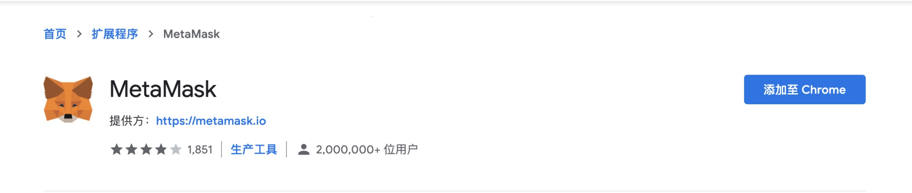
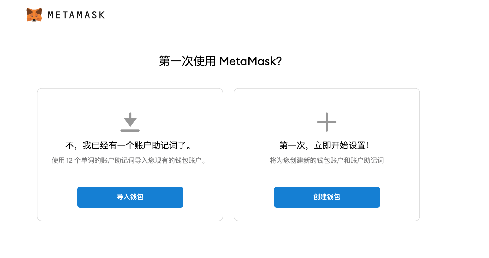
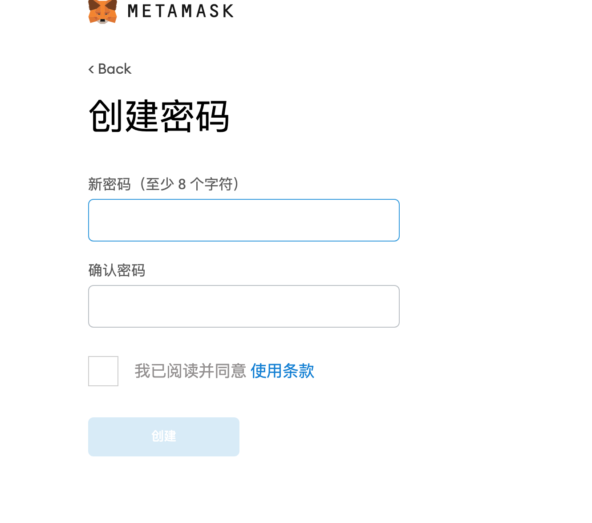
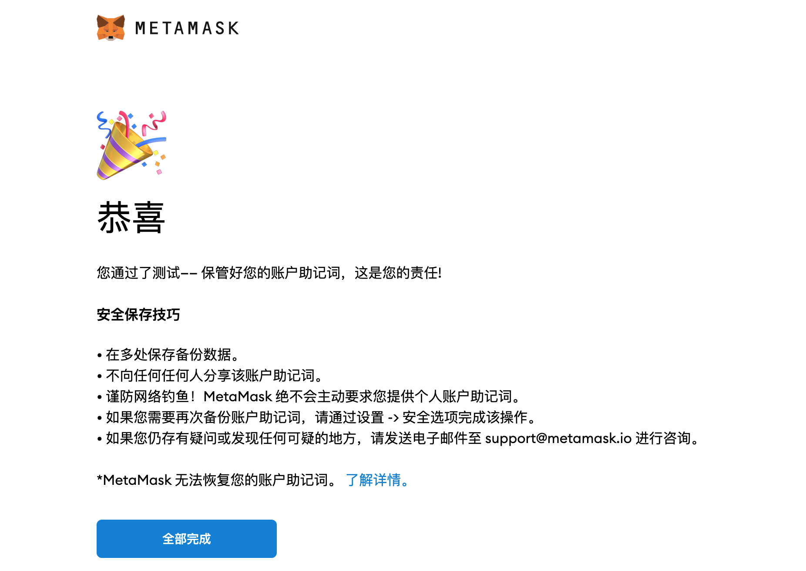
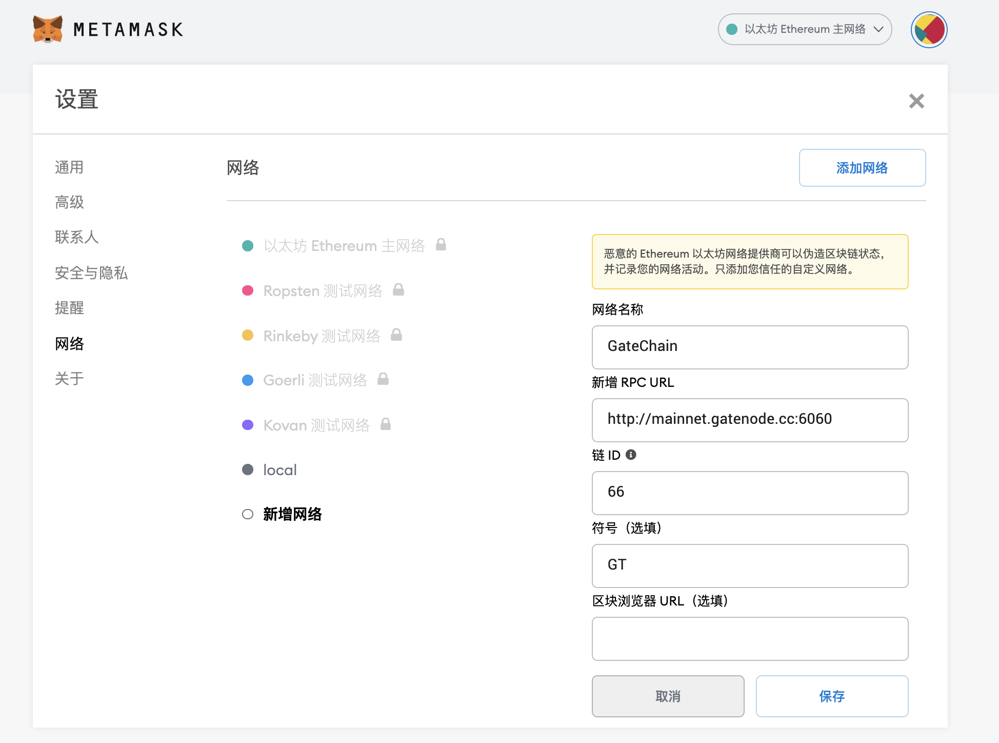
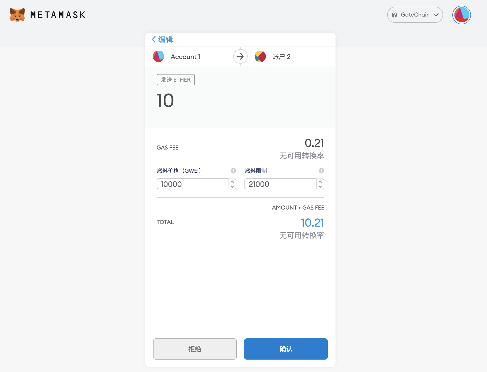
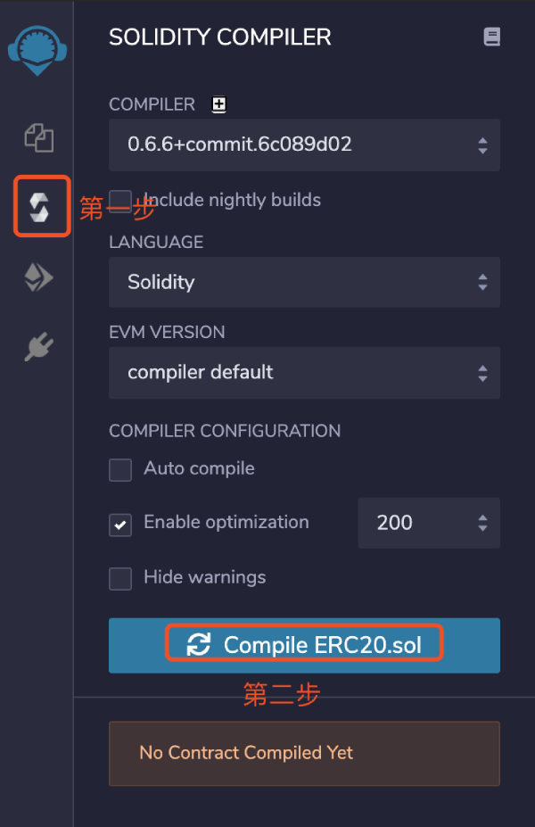
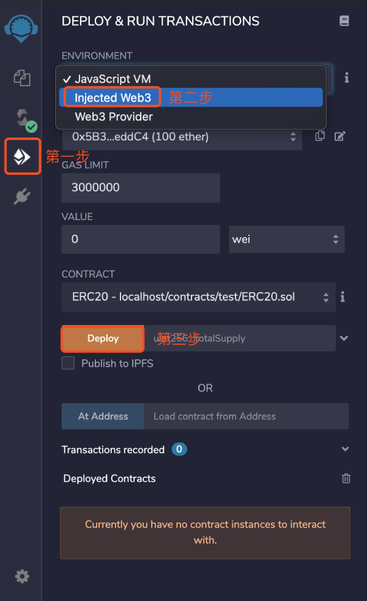

## 区块链浏览器
主网：https://gatescan.org/

测试网：https://gatescan.org/testnet/

Meteora：https://gatescan.org/meteora/

## 官方钱包下载
下载地址：https://www.gatechain.io/wallets

## <span id="MetaMask接入指南">MetaMask接入指南</span>

GateChain-Evm是基于Gatemint共识的原生模块，支持运行以太坊智能合约及提供rpc服务来兼容MetaMask接入，用户只需切换网络即可在GateChain部署及调用合约等。

### MetaMask简介

MetaMask是为了创建更安全和可用的以太坊网站而创建的。特别是，它处理帐户管理并将用户连接到区块链。Chrome、Brave和Safari浏览器都支持它。

### 安装

示例:在Chrome浏览器中安装

1. 在Chrome浏览中搜索：https://chrome.google.com/webstore/search/MetaMask
	* 注意：请确保它由metamask.io提供


2. 点击“添加至Chrome”，安装成功，接下来快去创建钱包吧！



### 创建账户

1. 可以选择导入钱包或创建钱包，点击“创建钱包”

2. 输入密码及备份账户助记词


3. 完成助记词验证后，创建账户成功，接下来快去与gatechain网络连接吧!



### 将您的MetaMask与GateChain网络连接

1. 点击MetaMask-设置-网络-添加网络，配置GateChain网络服务


> 网络名称: GateChain （可自定义）
> 
> RPC URL1: https://evm.gatenode.cc
> 
> RPC URL2: https://evm-cn1.gatenode.cc:6061
> 
> 链 ID: 66
> 
> 符号: GT
> 
> 区块浏览器: https://gatescan.org/


### 将您的“gt”账户余额转入到MetaMask账户余额中

1. 钱包转账:复制MetaMask账户地址，粘贴到钱包-转账-接收地址中，进行转账[[具体操作步骤]](../gatechain-wallet.md#evm)

2. CLI或RPC转账：与普通转账交易一样，只需替换接收人地址即可。
> [[CLI操作步骤]](../cli/tx.md#发送交易-api)
> 
> [[RPC操作步骤]](../API/tx.md#发送交易-命令行)

### 将您的GT转账到MetaMask其他账户中

1. 选择要转账的账户，进入主页点击“发送”按钮。

2. 输入要发送的账户地址及金额，点击“下一步”。

3. 确认交易信息，点击“确认”，等待交易打包。

4. 交易成功后可以去gatechain浏览器查看交易详细信息。
	
* 浏览器地址：https://gatescan.org/txs

>合约部署及合约交互等介绍请继续往下看吧！

## <span id="Remix接入指南">Remix接入指南</span>

### Remix简介
Remix是一个开源的用于Solidity智能合约开发的Web端IDE，提供基本的编译、部署至本地或测试网络、执行合约等功能。Solidity是Ethereum官方设计和支持的程序语言，专门用于编写智能合约。

### 创建合约

1. 打开remix网址（http://remix.ethereum.org ），点击“New File”创建XXX.sol文件。

2. 点击创建好的文件，编写自己的智能合约代码。
3. 开发完成后，编译合约。


### 合约部署和交互

1. 编译成功后，开始部署合约。
	
2. 点击“Deploy”开始部署合约，跳转到MetaMask与您的账户连接。

	>（请确保MetaMask网络已切换到GateChain）

	
3. 打开部署好的合约，就可以选择某项功能与MetaMask进行交互啦!
	
4. 查询合约交互的交易详细信息，可以去gatechain浏览器查看。

	* 区块浏览器地址：https://gatescan.org/txs

## <span id="Truffle接入指南">Truffle接入指南</span>

### 搭建开发环境
在开始之前，请保证环境达到以下要求：
* Node.js v8.9.4 或者更高
* Windows，Linux，或Mac OS X

### 创建项目
1. 首先创建一个项目，在终端输入以下内容：

	```
	mkdir testproject
	```
2. 初始化该项目，在终端输入以下内容：

	```
	cd testproject
	truffle init
	```
完成此操作后，你会得到一个包含以下项目的项目结构：

	```
	contracts/：Truffle默认的合约文件存放目录。
	migrations /：可编写脚本的部署文件的目录。
	test /：用于测试应用和合约的测试文件目录。
	truffle-config.js：Truffle的配置文件。
	```
3. contracts在此目录下编写自己的智能合约。

### 编译及部署项目

1. 要编译Truffle项目，请转至为项目所在目录的根目录，然后在终端中输入以下内容：

	```
	truffle compile
	```
2. 配置GateChain网络，请转至“truffle-config.js”文件。

	```
	const HDWalletProvider = require('truffle-hdwallet-provider');
	const fs = require('fs');
	const mnemonic = fs.readFileSync(".secret").toString().trim();
	
	module.exports = {
	  networks: {
	    GateChain: {
	      provider: () => new HDWalletProvider(mnemonic, `https://evm.gatenode.cc`),
	      network_id: 66,
	      confirmations: 10,
	      timeoutBlocks: 200,
	      skipDryRun: true
	    },
	  },
	
	  mocha: {
	    timeout: 100000 // prevents tests from failing when pc is under heavy load
	  },
	
	  compilers: {
	    solc: {
	    }
	  }
	}
	```
	> 注意：需要配置MetaMask助记词，请从部署账户的助记词，获取方法：MetaMask-设置-安全与隐私，在根目录中创建一个新的.secret文件，然后输入助记词来开始使用。

3. 部署项目，请在终端中输入以下内容：

	```
	truffle migrate --network GateChain
	```
4. 合同将部署在GateChain网络中，如下所示：

```
	Compiling your contracts...
	===========================
	> Everything is up to date, there is nothing to compile.
		
		
	Starting migrations...
	======================
	> Network name:    'GateChain'
	> Network id:      66
	> Block gas limit: 4294967295 (0xffffffff)
		
		
	1_initial_migration.js
	======================
		Replacing 'Migrations'
		----------------------
		> transaction hash:    0x2eaa10bd0a8cdd55022fd6a16372659a5fd52151b216a82d07f397c1c91642fe
		> Blocks: 0            Seconds: 4
		> contract address:    0x871e6B5eEaC4d69E33880cac1997F1374302eddC
		> block number:        98767
		> block timestamp:     1614756393
		> account:             0x06ae7981a16379fD627a879Ec017AaDFaa4BEf59
		> balance:             260.04901
		> gas used:            128511 (0x1f5ff)
		> gas price:           10000 gwei
		> value sent:          0 ETH
		> total cost:          1.28511 ETH
		   
	Summary
	=======
	> Total deployments:   1
	> Final cost:          1.28511 ETH
	
```
	
> 注意：以上内容均为示例，只是为了提供结构思路。


