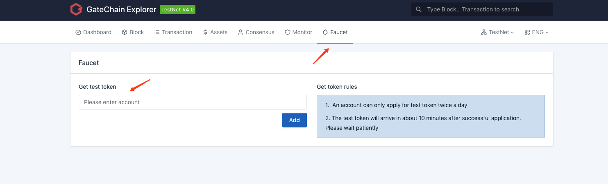

 - ### Get Testnet GT From wallet：

	- At wallet overview interface, you can see a “Give me GT” icon. Click it and a testnet GT application is sent. Testnet GT will display at your wallet balance a few minutes later.{:height=60% width=60%}

- ### Get Testnet GT From Website：
	- <a href="https://gatescan.org/faucet" target="_blank">Visit website</a>
	- Enter the account address to receive testnet GT and click to add application. Testnet GT will display at your wallet balance a few minutes later. {:height=60% width=60%} 

> Each account can apply once per 24 hours. Each time applying for testnet GT from wallet will have the following prompt.

  {:height=60% width=60%} 

