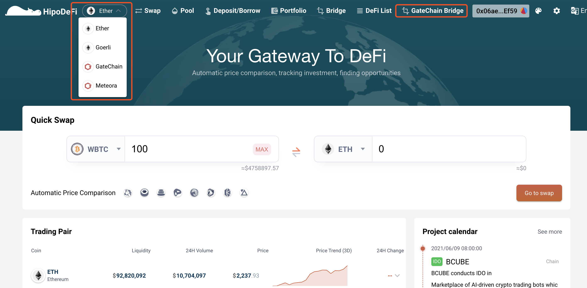

## GateBridge

### Introduction
  1. Cross-chain through smart contract:  refers to a way to communicate with GateChain, BSC and HECO via a trusted Ethereum smart contract in order to transfer assets back and forth between those chains.
  2. Cross-chain from  Ethereum to BSC/HECO:  asset on Ethereum must be transferred to GateChain first, and then to BSC or HECO；
  3. ERC20 tokens on Ethereum and their corresponding tokens on GateChain, BSC and HECO are matched. Users should make a token cross-chain registration request [here](https://gatescan.org/bridge).

### How to use
  1. Open [Hipo](https://www.hipo.com/Ether/en/) website and switch to the correct network, click GateChain Bridge.
	

  2. Click Connect Wallet to connect your wallet to Hipo.
	

  3. On Cross-Chain Swap page, choose Network, and enter the token address to cross-chain swap. （The token address should be the address of their original network. See [Crosschain Tokens](https://gatescan.org/bridge).) Enter the amount and recipient address and then click "Approve".
	* Selected network on Hipo must be the same with that on your wallet. 
	* [Connect to GateChain Network](../rpc-node-list.md)
	* [Connect to BSC](https://academy.binance.com/zh/articles/connecting-metamask-to-binance-smart-chain)
	* [Connect to HECO](https://docs.hecochain.com/#/mainnet)
	
	

  4.After authorization, click “Next” to cross-chain swap；

	* Make sure you have enough balance for network fee charges.

 

  5.When the transaction is successful on its original network, wait for 5 minutes and then switch to the target network to view balance.

  

