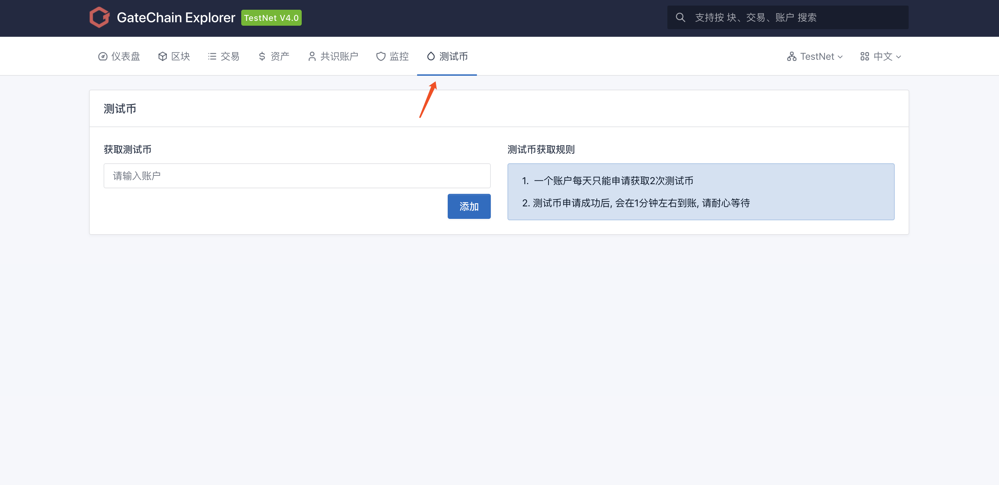
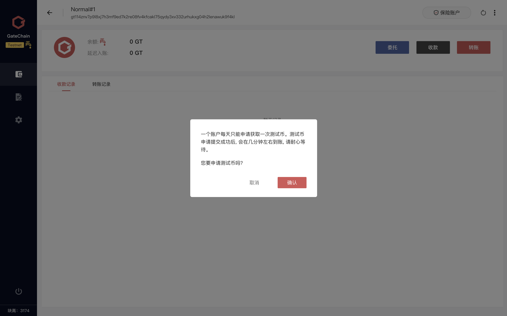

- ### 通过钱包获得测试币：

	- 钱包账户概览界面有 “获得测试币 (Give me GT) 图标”，点击后会自动向测试链提交申请拨发测试币，几分钟后测试币就显示在钱包余额里面了。{:height=60% width=60%}

- ### 通过网站获得测试币：
 
	- <a href="https://gatescan.org/faucet" target="_blank">申请测试币入口</a>
	- 输入要获取测试币的账户地址，点击添加申请，几分钟后测试币就显示在钱包余额里面了。
 {:height=60% width=60%} 

* 注：每个账户在24小时内只能申请一次测试币，每次通过钱包申请测试币将获得以下提示。
	 {:height=60% width=60%} 